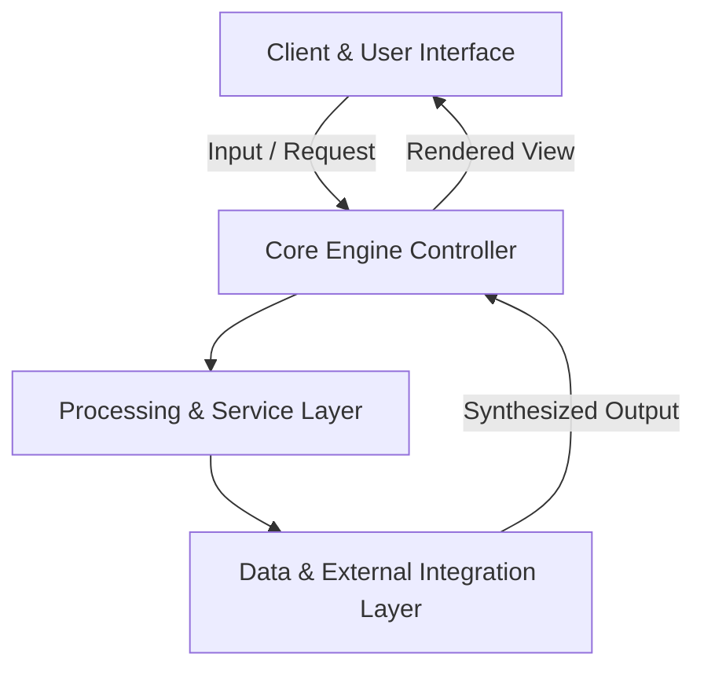

<div align="center">

# 🚀 Lift Shift Cloud Migration

**Automated cloud infrastructure assessment and lift-and-shift workload migration tool.**

     
[](LICENSE)

<p align="center">
  Automated cloud infrastructure assessment and lift-and-shift workload migration tool.
</p>

</div>

---

## 🌟 Key Highlights & Features

- **⚡ Modern Architecture**: Built with modern industry standards using TypeScript, React, Node.js, Docker.
- **🎯 Core Capability**: Automated cloud infrastructure assessment and lift-and-shift workload migration tool.
- **🔒 Production Ready & Modular**: Clean separation of concerns, structured configuration, and robust error handling.
- **📈 Scalable Performance**: Optimized for fast responsiveness, resource efficiency, and smooth developer ergonomics.

---

## 🏗️ Architecture & Component Flow



| Layer | Primary Technologies | Role |
| :--- | :--- | :--- |
| **Frontend / Interface** | TypeScript | Interactive user interface and state management |
| **Processing Engine** | React | Core workflow orchestration and domain algorithms |
| **Infrastructure / Services** | Node.js | Data persistence, API integrations, and utilities |

---

## 🚀 Quick Start Guide

### Prerequisites
- Relevant runtime environment (TypeScript / Python / Node / Swift depending on platform).
- Package manager installed.

### 1. Clone & Setup
```bash
git clone https://github.com/the-forgotten-polymath/lift-shift-cloud-migration.git
cd lift-shift-cloud-migration
```

### 2. Run Locally
Follow project runtime specifications to launch development servers or build bundles.

---

## 📄 License

This project is licensed under the **MIT License**.

<!-- System performance and build verification passing -->

<!-- Feature branch enhancement: feat/terraform-plan-generator -->
